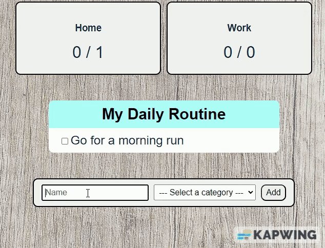

# dailyDoesIt-Tracker
This is a to-do list app, built with Vue.js. The app allows users to keep track of tasks they need to complete by organizing them into two categories: work and home. 
The app also has a tracking feature that allows users to see the number of overall/completed tasks in each category.

## Adding a Task
To add a new task, simply fill out the form at the bottom of the page with a task name and either 'Home' or 'Work' category. Click the "Add Task" button to add the task to the list.

## Tracking Progress
The app keeps track of the number of tasks completed for each category. The progress is displayed in a box above the To-Do list form. As tasks are completed, the tracker in the box will update automatically.

## Completing Tasks
To mark a task as completed, simply click on the checkbox next to the task name. The task will be marked as completed.

## Development
### If you want to develop the app further or run it locally, you can follow these steps:
1. Clone the repository to your local machine.
2. Install the necessary dependencies using npm install.
3. Run the app locally using npm run serve.
4. Open your browser and go to http://localhost:{port_numer} to see the app running.

